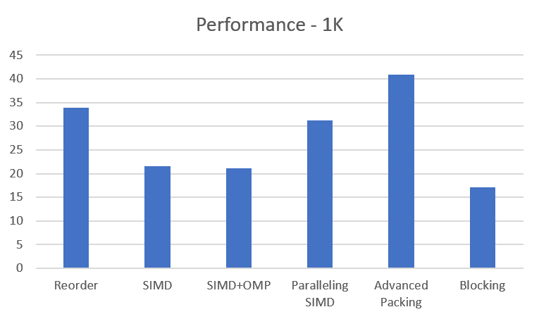
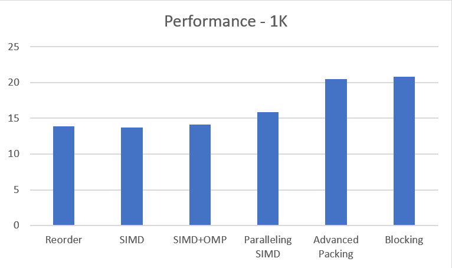
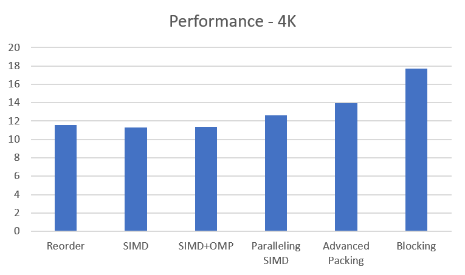
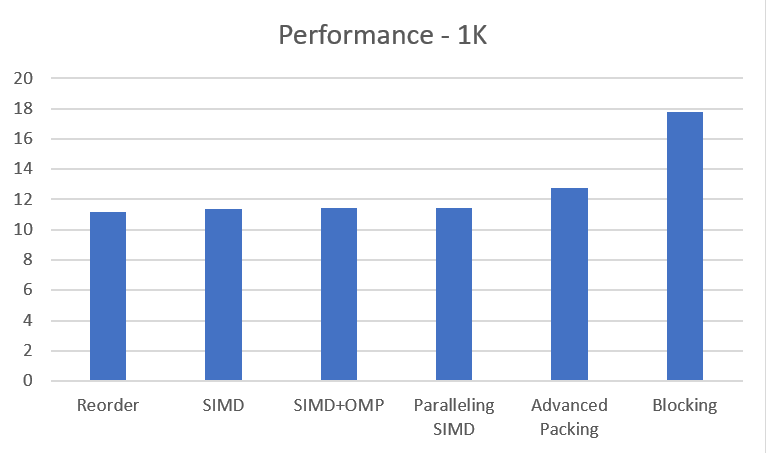

# CS205 Project 4 Report

Reference: https://github.com/flame/how-to-optimize-gemm/wiki

---

对于本 Project 的代码，编译时均默认开启 `-O3` 优化。

**测试环境**
- CPU: AMD Ryzen7 3700X 8c16t
- RAM: 8G * 2 3200Mhz DDR4 RAM
## Part 1 - Analysis + Code

本 Project 要求对矩阵乘法进行加速。接下来考虑一些可能的优化方式。

对于两个 $N * N$ 的矩阵相乘，使用朴素方法需要进行 $N^3$ 次浮点数乘法、$N^3$ 次浮点数加法运算。因此我们用 $\frac{2N^3}{t}$ FLOPS 作为衡量算法效率的基准。数据均为对 3 次运算取平均值。

### 朴素的矩阵乘法
```c
for (i = 0; i < a->row; i++)
    for (j = 0; j < b->col; j++)
        for (k = 0; k < row; k++)
            c[i * col + j] += a->pData[i * a->col + k] * b->pData[k * b->col + j]; 
```

**效率**: $N = 2048，t=57546 \text{ms}$，3.365 GFLOP/s

### 优化 1 - 调换循环顺序
考虑朴素的矩阵乘法实现：
```c
for (i = 0; i < a->row; i++)
    for (j = 0; j < b->col; j++)
        for (k = 0; k < row; k++)
            c[i * col + j] += a->pData[i * a->col + k] * b->pData[k * b->col + j]; 
```
注意到，在此处对于 `a->pData` 的内存访问的连续的，但是对于 `b->pData` 不是，这样就导致了 cache 命中率不高，因此可以从考虑连续进行内存读写的角度入手，提高 cache 命中率。

可以选择以 `ikj` 的顺序进行循环，使用一个寄存器存下 `a->pData` 的元素，然后连续的乘上 `b->pData` 中的每一行元素，这样就可以实现连续访问内存，提高 cache 命中率。

```c
register float r;
for (i = 0; i < row; i++) {
    for (k = 0; k < a->col; k++) {
        r = a->pData[i * a->col + k];
        for (j = 0; j < col; j++)
            pData[i * col + j] += r * b->pData[k * col + j];
    }
}
```

**效率**： $N = 2048，t=1180 \text{ms}$，13.559 GFLOP/s

### 优化2 - 内存重排 + 向量化
考虑矩阵乘法本质上是对向量进行数乘，因此考虑使用 AVX2 指令集对元素进行向量化。在此之前，先对矩阵 B 进行内存重排，对其求转置，不连续的列向量转换为连续的行向量。同时，为了减少使用乘法指令，在这里可以对 `i * b->col` 进行预处理，进一步提高速度。

```c
// 预处理 i * col
for (i = 0; i < a->row; i++)
    paddingA[i] = i * a->col;
for (i = 0; i < b->row; i++)
    paddingB[i] = i * b->col;

// 求转置，这里不知道有没有办法对 transpose 和 b->pData 进行连续访问优化
k = 0;
for (i = 0; i < b->col; i++) 
    for (j = 0; j < b->row; j++) {
        transpose[k++] = b->pData[i + paddingB[j]];
    }
```

内存重排后就可以直接使用 AVX2 指令进行向量化了。

```c
__m256 x, y, z = _mm256_setzero_ps();

for (i = 0; i < row; i++) {
    for (j = 0; j < col; j++) {
        pos = paddingA[i] + j;
        z = _mm256_setzero_ps();                 
        if (upBound >= 8) {
            for (k = 0; k < upBound; k += 8) {
                x = _mm256_load_ps(p + paddingA[i] + k);
                y = _mm256_load_ps(transpose + paddingA[j] + k);
                z = _mm256_add_ps(z, _mm256_mul_ps(x, y));
            }
            _mm256_store_ps(sum, z);
            pData[pos] = sum[0]+sum[1]+sum[2]+sum[3]+sum[4]+sum[5]+sum[6]+sum[7];
        }
        k = (upBound / 8) * 8;
        for (; k < upBound; k++)
            pData[pos] += a->pData[paddingA[i] + k] * transpose[paddingA[i] + k];
    }
}
```

**效率**： $N = 2048，t=1209 \text{ms}$，13.234 GFLOP/s

发现对于调换 for 循环顺序没有明显进步。或许是 `-O3` 下编译器对调换顺序方法的优化做的足够好了。但不开启优化的情况下比调换顺序的方法运算速度快了许多。

### 优化 3 - OpenMP
在可以并行的 for 循环前加上 `#pragma omp parallel for` 即可
```c
#pragma omp parallel for
for (i = 0; i < a->row; i++)
    paddingA[i] = i * a->col;
#pragma omp parallel for
for (i = 0; i < b->row; i++)
    paddingB[i] = i * b->col;

// ...

#pragma omp parallel for
for (i = 0; i < row; i++) {
    for (j = 0; j < col; j++) {
        pos = paddingA[i] + j;
        z = _mm256_setzero_ps();                 
        if (upBound >= 8) {
            for (k = 0; k < upBound; k += 8) {
                x = _mm256_load_ps(p + paddingA[i] + k);
                y = _mm256_load_ps(transpose + paddingA[j] + k);
                z = _mm256_add_ps(z, _mm256_mul_ps(x, y));
            }
            _mm256_store_ps(sum, z);
            pData[pos] = sum[0]+sum[1]+sum[2]+sum[3]+sum[4]+sum[5]+sum[6]+sum[7];
        }
        k = (upBound / 8) * 8;
        for (; k < upBound; k++)
            pData[pos] += a->pData[paddingA[i] + k] * transpose[paddingA[i] + k];
    }
}
```
**效率**： $N = 2048，t=1179 \text{ms}$，13.571 GFLOP/s

没有很明显的加速。与老师上课演示的 OpenMP 效果差不多。（为什么？）

### 优化 4 - _m256 并行
发现，3700X 分别有 512K 和 4M 的 L1, L2 缓存，可能对于前文中实现的向量化，在一次运算中并没有把缓存占满，因此考虑对向量化的部分进行循环展开，使用更多的 _m256 进行点乘运算，尽可能多的使用缓存。

```c
#pragma omp parallel for 
for (i = 0; i < row; i++) {
    for (j = 0; j < col; j++) {
        pos = paddingA[i] + j;
        z1 = _mm256_setzero_ps();
        z2 = _mm256_setzero_ps();
        z3 = _mm256_setzero_ps();
        z4 = _mm256_setzero_ps();
        z5 = _mm256_setzero_ps();
        z6 = _mm256_setzero_ps();
        z7 = _mm256_setzero_ps();
        z8 = _mm256_setzero_ps();
        if (upBound >= 8) {
            for (k = 0; k < upBound; k += 64) {
                x1 = _mm256_load_ps(p + paddingA[i] + k);
                y1 = _mm256_load_ps(transpose + paddingA[j] + k);
                z1 = _mm256_add_ps(z1, _mm256_mul_ps(x1, y1));

                x2 = _mm256_load_ps(p + paddingA[i] + k + 8);
                y2 = _mm256_load_ps(transpose + paddingA[j] + k + 8);
                z2 = _mm256_add_ps(z2, _mm256_mul_ps(x2, y2));

                x3 = _mm256_load_ps(p + paddingA[i] + k + 16);
                y3 = _mm256_load_ps(transpose + paddingA[j] + k + 16);
                z3 = _mm256_add_ps(z3, _mm256_mul_ps(x3, y3));

                x4 = _mm256_load_ps(p + paddingA[i] + k + 24);
                y4 = _mm256_load_ps(transpose + paddingA[j] + k + 24);
                z4 = _mm256_add_ps(z4, _mm256_mul_ps(x4, y4));

                x5 = _mm256_load_ps(p + paddingA[i] + k + 32);
                y5 = _mm256_load_ps(transpose + paddingA[j] + k + 32);
                z5 = _mm256_add_ps(z1, _mm256_mul_ps(x5, y5));

                x6 = _mm256_load_ps(p + paddingA[i] + k + 40);
                y6 = _mm256_load_ps(transpose + paddingA[j] + k + 40);
                z6 = _mm256_add_ps(z2, _mm256_mul_ps(x6, y6));

                x7 = _mm256_load_ps(p + paddingA[i] + k + 48);
                y7 = _mm256_load_ps(transpose + paddingA[j] + k + 48);
                z7 = _mm256_add_ps(z3, _mm256_mul_ps(x6, y6));

                x8 = _mm256_load_ps(p + paddingA[i] + k + 56);
                y8 = _mm256_load_ps(transpose + paddingA[j] + k + 56);
                z8 = _mm256_add_ps(z4, _mm256_mul_ps(x7, y7));
            }
            z2 = _mm256_add_ps(z2, z1);
            z3 = _mm256_add_ps(z3, z2);
            z4 = _mm256_add_ps(z4, z3);
            z5 = _mm256_add_ps(z5, z4);
            z6 = _mm256_add_ps(z6, z5);
            z7 = _mm256_add_ps(z7, z6);
            z8 = _mm256_add_ps(z8, z7);

            _mm256_store_ps(sum, z8);
            pData[pos] = sum[0]+sum[1]+sum[2]+sum[3]+sum[4]+sum[5]+sum[6]+sum[7];
        }
        k = (upBound / 64) * 64;
        for (; k < upBound; k++)
            pData[pos] += p[paddingA[i] + k] * transpose[paddingA[i] + k];
    }
}
```
**效率**：$N = 2048，t=948 \text{ms}$，17.525 GFLOP/s

效率比不并行提升许多。

### 优化 5 - 优化内存重排
在优化 2 中，对于内存重排的实现如下：
```c
k = 0;
for (i = 0; i < b->col; i++) 
    for (j = 0; j < b->row; j++)
        transpose[k++] = b->pData[i + paddingB[j]];
```
该代码相当于开了一块新的内存，对于 `b->pData` 进行不连续的拷贝，因此效率可能偏低。考虑使用寄存器直接在 `b->pData` 内进行元素交换实现内存重排。

```c
register float t;
#pragma omp parallel for
for (i = 0; i < b->row; i++) 
    for (j = i + 1; j < b->col; j++) {
        t = transpose[paddingB[i] + j];
        transpose[paddingB[i] + j] = transpose[paddingB[j] + i];
        transpose[paddingB[j] + i] = t;
    }
```

**效率**: $N = 2048，t=780 \text{ms}$，20.51 GFLOP/s

优化后的重排方式进一步提升了效率

### 优化 6 - 矩阵分块
在数据规模较小的情况下，之前的优化方法性能均较为稳定。但规模增大后，由于 L2 缓存的大小会很快被用完，考虑到矩阵运算为密集型运算，应该将计算集中到一个访存范围集中，这样可以减少 cache 被重复刷新带来的延迟。由线性代数的知识可以知道，对于矩阵进行分块后，对子矩阵进行运算等同于对矩阵。考虑将单位的矩阵设置为 $N=8$ 的单元矩阵，此后，考虑对进一步对单元矩阵进行 KC * KC 分块进行运算。KC * KC 需要根据矩阵规模进行进一步调整。

```c
// 对单元矩阵进行运算，直接循环展开
inline void multiplyMatrixDoBlock(float *a, size_t aCol, 
                                  float *transpose, size_t bCol, 
                                  float *c, 
                                  size_t *paddingA, size_t *paddingB, 
                                  float *sum) {
    if (a && transpose && c) { 
        size_t i, j, k;

        __m256 x[8], y[8], z[8];

        // Load 16 vectors at the same time
        x[0] = _mm256_load_ps(a + paddingA[0]);
        y[0] = _mm256_load_ps(transpose + paddingA[0]);
        // ...
        #pragma omp parallel for
        for (i = 0; i < BLOCK_SIZE; i++) {
            z[0] = _mm256_mul_ps(x[i], y[0]);
            // ...
            z[7] = _mm256_mul_ps(x[i], y[7]); 

            _mm256_store_ps(sum, z[0]);
            // ...
            _mm256_store_ps(sum + 56, z[7]);

            c[paddingB[i]] += sum[0]+sum[1]+sum[2]+sum[3]+sum[4]+sum[5]+sum[6]+sum[7];
            // ...
            c[paddingB[i] + 7] += sum[56]+sum[57]+sum[58]+sum[59]+sum[60]+sum[61]+sum[62]+sum[63];
        }
    }
}

// ...
int multiplyMatrix_Packing_SIMD_OMP_Blocking(struct Matrix *const a, const struct Matrix *const b) {
    // ...
    for (i = 0; i < row; i += KC) {
        for (j = 0; j < col; j += KC) {
            #pragma omp parallel for
            for (k = 0; k < a->col; k += KC) {
                multiplyMatrixDoBlock(
                    a->pData + paddingA[i] + k, a->col, 
                    transpose + paddingA[j] + k, b->col, 
                    pData + paddingB[i] + j, 
                    paddingA, paddingB, sum
                );
                // ... other blocks
            }
        }
    }
}

```
效率：$N = 2048，t=913 \text{ms}$， 17.525 GFLOP/s

发现在 2048 * 2048 的矩阵规模下对于其他的方法没有明显的进步，对 $N=4096$ 进行测试。

- 对于优化 5 的方法：$N = 4096，t=9046 \text{ms}$， 14.145 GFLOP/s
- 对于分块的方法: $N = 4096，t=7286 \text{ms}$， 17.568 GFLOP/s

相比优化 5，浮点运算效率下降较少。

## Part 2 - Tests
引入了OpenBLAS进行测试。同时，在小规模 (16, 32, 64, 128) 数据进行了正确性检查。
### Test 1 - N = 16
```
Test start, matrix size: 16
Start generate matrix with random elements
Generated
Start calculating
Plain method start
Plain method: 0ms
OpenBLAS SGEMM start
OpenBLAS SGEMM: 0ms
Reordered for start
Reordered for: 0ms
Packing + SIMD method start
Packing + SIMD method: 0ms
Packing + SIMD + OpenMP method start
Packing + SIMD + OpenMP method: 0ms
Packing + SIMD + OpenMP + Paralleling method start
Packing + SIMD + OpenMP + Paralleling method: 0ms
Advanced packing + SIMD + OpenMP + Paralleling method start
Advanced packing + SIMD + OpenMP + Paralleling method: 0ms
Advanced packing + SIMD + OpenMP + Paralleling + Blocking method start
Advanced packing + SIMD + OpenMP + Paralleling + Blocking: 0ms
```
矩阵规模过小，无明显差距。

### Test 2 - N = 128
```
Test start, matrix size: 128
Start generate matrix with random elements
Generated
Start calculating
Plain method start
Plain method: 2ms
OpenBLAS SGEMM start
OpenBLAS SGEMM: 0ms
Reordered for start
Reordered for: 0ms
Packing + SIMD method start
Packing + SIMD method: 0ms
Packing + SIMD + OpenMP method start
Packing + SIMD + OpenMP method: 0ms
Packing + SIMD + OpenMP + Paralleling method start
Packing + SIMD + OpenMP + Paralleling method: 1ms
Advanced packing + SIMD + OpenMP + Paralleling method start
Advanced packing + SIMD + OpenMP + Paralleling method: 0ms
Advanced packing + SIMD + OpenMP + Paralleling + Blocking method start
Advanced packing + SIMD + OpenMP + Paralleling + Blocking: 0ms
```
矩阵规模过小，无明显差距。除去朴素的做法，无明显差距。

### Test 3 - N = 1024 
```
Test start, matrix size: 1024
Start generate matrix with random elements
Generated
Start calculating
Plain method start
Plain method: 7068ms
OpenBLAS SGEMM start
OpenBLAS SGEMM: 6ms
Reordered for start
Reordered for: 59ms
Packing + SIMD method start
Packing + SIMD method: 93ms
Packing + SIMD + OpenMP method start
Packing + SIMD + OpenMP method: 95ms
Packing + SIMD + OpenMP + Paralleling method start
Packing + SIMD + OpenMP + Paralleling method: 64ms
Advanced packing + SIMD + OpenMP + Paralleling method start
Advanced packing + SIMD + OpenMP + Paralleling method: 49ms
Advanced packing + SIMD + OpenMP + Paralleling + Blocking method start
Advanced packing + SIMD + OpenMP + Paralleling + Blocking: 117ms
```
最优方法与 OpenBLAS 有 8 倍左右的性能差距。

### Test 4 - N = 2048
```
Test start, matrix size: 2048
Start generate matrix with random elements
Generated
Start calculating
Plain method start
Plain method: 48247ms
OpenBLAS SGEMM start
OpenBLAS SGEMM: 32ms
Reordered for start
Reordered for: 1156ms
Packing + SIMD method start
Packing + SIMD method: 1164ms
Packing + SIMD + OpenMP method start
Packing + SIMD + OpenMP method: 1130ms
Packing + SIMD + OpenMP + Paralleling method start
Packing + SIMD + OpenMP + Paralleling method: 1008ms
Advanced packing + SIMD + OpenMP + Paralleling method start
Advanced packing + SIMD + OpenMP + Paralleling method: 780ms
Advanced packing + SIMD + OpenMP + Paralleling + Blocking method start
Advanced packing + SIMD + OpenMP + Paralleling + Blocking: 768ms
```
最优方法与 OpenBLAS 有 24.375 倍的性能差距。

### Test 5 - N = 4096
```
Test start, matrix size: 4096
Start generate matrix with random elements
Generated
Start calculating
OpenBLAS SGEMM start
OpenBLAS SGEMM: 225ms
Reordered for start
Reordered for: 11065ms
Packing + SIMD method start
Packing + SIMD method: 11300ms
Packing + SIMD + OpenMP method start
Packing + SIMD + OpenMP method: 11238ms
Packing + SIMD + OpenMP + Paralleling method start
Packing + SIMD + OpenMP + Paralleling method: 10126ms
Advanced packing + SIMD + OpenMP + Paralleling method start
Advanced packing + SIMD + OpenMP + Paralleling method: 9183ms
Advanced packing + SIMD + OpenMP + Paralleling + Blocking method start
Advanced packing + SIMD + OpenMP + Paralleling + Blocking: 7219ms
```
最优方法与 OpenBLAS 有 32.08 倍的性能差距。

### Test 6 - N = 8192
```
Start calculating
OpenBLAS SGEMM start
OpenBLAS SGEMM: 1393ms
Reordered for start
Reordered for: 91732ms
Packing + SIMD method start
Packing + SIMD method: 90104ms
Packing + SIMD + OpenMP method start
Packing + SIMD + OpenMP method: 89653ms
Packing + SIMD + OpenMP + Paralleling method start
Packing + SIMD + OpenMP + Paralleling method: 89312ms
Advanced packing + SIMD + OpenMP + Paralleling method start
Advanced packing + SIMD + OpenMP + Paralleling method: 80204ms
Advanced packing + SIMD + OpenMP + Paralleling + Blocking method start
Advanced packing + SIMD + OpenMP + Paralleling + Blocking: 57607ms
```
发现分块的方法快了许多。

### Test 7 - N = 65536
Out of memory.

---
## Part 3 - Performance
单位: GFLOP/s

**在 1K 下的性能分析：**


**在 2K 下的性能分析：**


**在 4K 下的性能分析：**


**在 8K 下的性能分析：**


## Part 4 - Difficulties & Problems

### 1 - 申请对齐的内存空间
在 Windows 下可以使用 `_aligned_malloc()`，但是 Linux 下只能使用 `aligned_alloc()`，而且这两个函数参数还不一样。对于 `_aligned_malloc()` 申请的内存空间，只能使用 `_aligned_free()` 释放，使用 `free()` 则会出现异常。

### 2 - 使用 AVX2
需要非常注意指针是否越界。使用 AVX2 指令集进行读取的时候越界则会直接出现异常，程序退出。

### 3 - 进一步优化
进一步优化方式我在 https://renzibei.com/2021/06/30/optimize-gemm/ 上面有看到，但是如果想进行进一步优化，需要了解汇编以及计组的知识，按目前的能力无法实现。